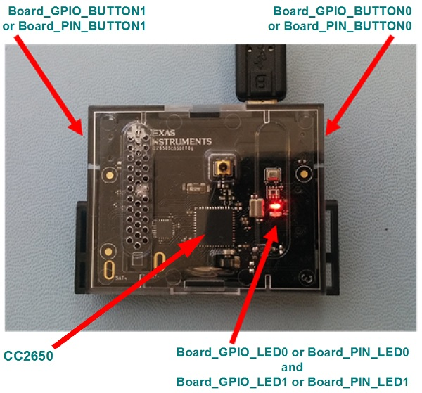

# CC2650 SimpleLink SensorTag Settings & Resources

The CC2650 SensorTag consists of a SensorTag board with a CC2650EM
(CC2650F128 device).

## Board resources used in driver examples

The following table lists the Board names of the resources used by
the driver examples, and their corresponding pins.  Note that there may be
other resources configured in the board files that are not used by any
driver example.  Only the example resources are listed in the table.

  |Board Resource|Pin|
  |--------------|:---|
  |`Board_GPIO_LED0`|DIO_10 (Red LED)|
  |`Board_GPIO_LED1`|DIO_15 (Green LED)|
  |`Board_GPIO_BUTTON0`|DIO_0 (Button 1)|
  |`Board_GPIO_BUTTON1`|DIO_4 (Button 2)|
  |`Board_I2C0`|I2C0, (SDA = DIO_5, SCL = DIO_6)|
  |`Board_PIN_BUTTON0`|DIO_0 (Button 1)|
  |`Board_PIN_BUTTON1`|DIO_4 (Button 2)|
  |`Board_PIN_LED0`|DIO_10 (Red LED)|
  |`Board_PIN_LED1`|DIO_15 (Green LED)|
  |`Board_PWM0`|GPTIMER0A, DIO_10|
  |`Board_PWM1`|GPTIMER0B, DIO_15|
  |`Board_SPI0`|SSI0, (MISO = DIO_18, MOSI = DIO_19, CLK = DIO_17|
  |`Board_UART0`|UART provided through emulation (RXD = DIO_28, TXD = DIO_29)|
  |`Board_WATCHDOG0`|Watchdog Timer WDT, (There is no pin associated with the WDT)|

## Display example notes

Due to a pin usage conflict on the SensorTag, the UART and the Watch LCD
can not be driven simultaneously. Consequently, the Watch LCD must be removed
when running examples that exercise the UART.

## PinShutdown example notes

The SensorTag core processor can not go into shutdown mode with the Debugger DevPack attached.
Consequently, to get the pinShutdown example to behave properly, you must detach the debugger
after downloading the code, and use a coin cell to power the SensorTag.

## Peripherals Used

The following list shows which CC2650STK peripherals are used by
driver and kernel applications. Driver examples control which peripherals (and which ports) are used.

* __TI-RTOS Kernel (SYS/BIOS)__
* Uses the CC26xx’s RTC timer and that timer's associated interrupts.
* The TI-RTOS Kernel manages the Interrupt Vector Table.
* __Drivers__
    * __Crypto:__ A CC13xx/CC26xx specific driver that uses the onboard AES Cryptoprocessor.
    * __GPIO:__ The GPIO driver is used in various examples to drive `Board_GPIO_LED0` and `Board_GPIO_LED1`, and to monitor the `Board_GPIO_BUTTON0` and `Board_GPIO_BUTTON1` buttons.
    * __I2C:__ The I2C driver is used to manage the`Board_I2C0` I2C instance.
    * __PIN:__ A CC13xx/CC26xx specific driver PIN driver that uses 2 output pins for the onboard `Board_PIN_LED0` and `Board_PIN_LED1`, and 2 input pins for buttons `Board_PIN_BUTTON0` and `Board_PIN_BUTTON1`.
    * __PWM:__ The PWM driver is used to modulate the intensity of the on board LED through the `Board_PWM0` PWM instance.
    * __UART:__ The UART driver uses `Board_UART0`, which is attached via the Debug DevPak. Emulation and UART communication are possible when the debugger is configured for Serial Wire Debugging.
    * __SPI:__ The SPI driver uses SPI0 for `Board_SPI0` SPI instance.
    * __Watchdog:__ The Watchdog driver example uses the Watchdog Timer WDT peripheral (`Board_WATCHDOG0`).

